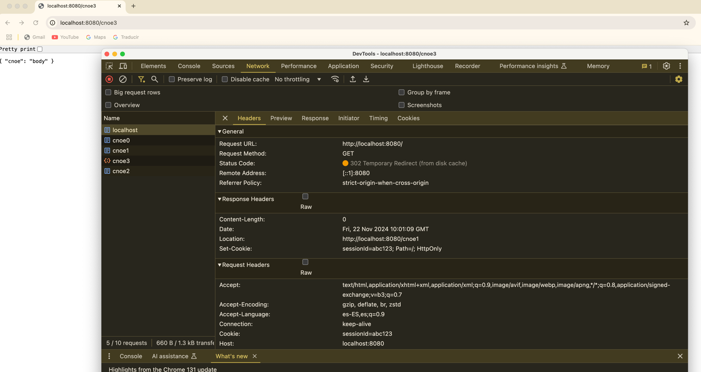

# BasicHTTPServer

A straightforward library to start a basic HTTP server with configurable routes and responses.  
Routes and their behaviors can be easily defined through JSON parameters, enabling quick setup for redirections, static responses, cookies, and more.

## How It Works

With this library, you can define both the **routes** and their corresponding **behaviors**. For instance:

### Example Configuration

```json
{
  "defaultPort": 8080,
  "routes": {
    "/": {
      "type": "redirect",
      "redirectUrl": "http://localhost:8080/cnoe0",
      "code": 301,
      "headers": {
        "Set-Cookie": "sessionId=abc123; Path=/; HttpOnly"
      }
    },
    "/cnoe0": {
      "type": "redirect",
      "redirectUrl": "http://localhost:8080/cnoe1",
      "code": 302,
      "headers": {
        "Set-Cookie": "sessionId=abc123; Path=/; HttpOnly"
      }
    },
    "/cnoe1": {
      "type": "redirect",
      "redirectUrl": "http://localhost:8080/cnoe2",
      "code": 302,
      "headers": {
        "Set-Cookie": "sessionId=abc123; Path=/; HttpOnly"
      }
    },
    "/cnoe2": {
      "type": "redirect",
      "redirectUrl": "http://localhost:8080/cnoe3",
      "code": 302,
      "headers": {
        "Set-Cookie": "sessionId=abc123; Path=/; HttpOnly"
      }
    },
    "/cnoe3": {
      "type": "static",
      "responseBody": "{ \"cnoe\": \"body\" }",
      "contentType": "application/json",
      "code": 200
    },
    "/cnoe4": {
      "type": "error",
      "errorMessage": "bad request",
      "code": 404
    }
  }
}
  
```

- The root route (`/`) redirects to `/cnoe0` and establishes the cookie:  
  `sessionId=abc123; Path=/; HttpOnly`.

- Route `/cnoe0` redirects to `/cnoe1` and sets the same cookie:  
  `sessionId=abc123; Path=/; HttpOnly`.

- Route `/cnoe1` redirects to `/cnoe2` with the same cookie:  
  `sessionId=abc123; Path=/; HttpOnly`.

- Route `/cnoe2` redirects to `/cnoe3` and again sets the cookie:  
  `sessionId=abc123; Path=/; HttpOnly`.

- Finally, route `/cnoe3` responds with `200 OK` and a JSON body:
  ```json
  {
    "cnoe": "body"
  }

